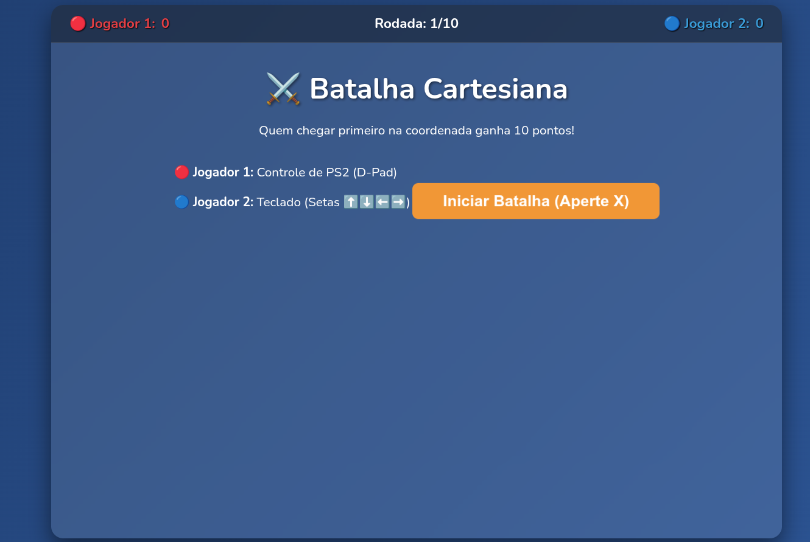
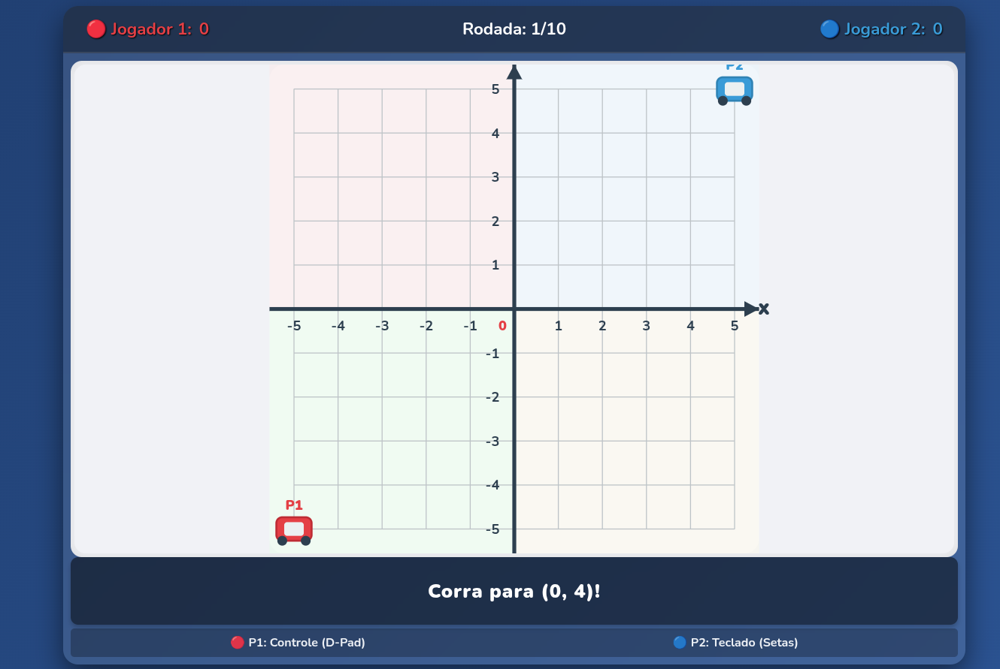
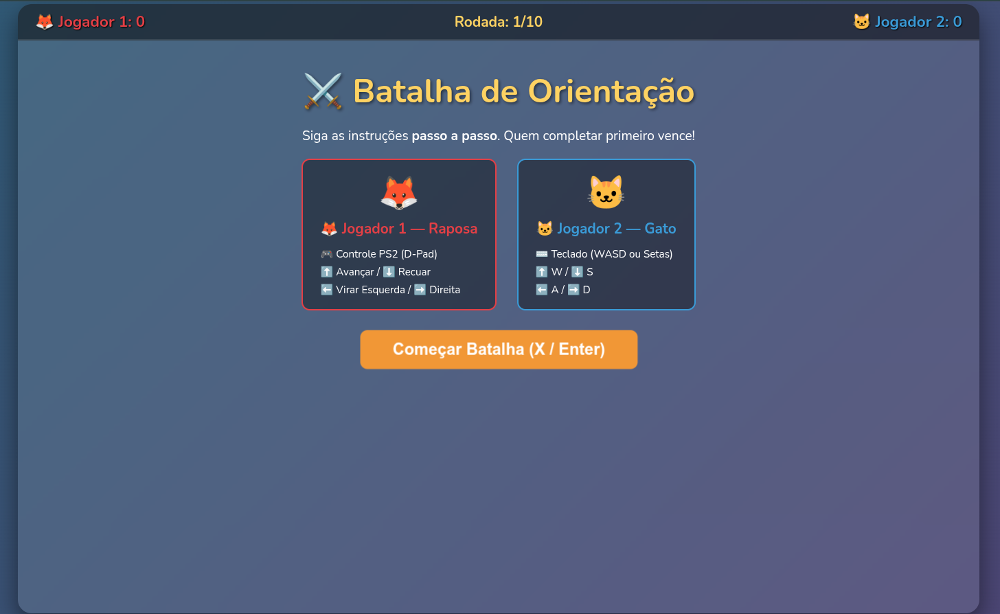
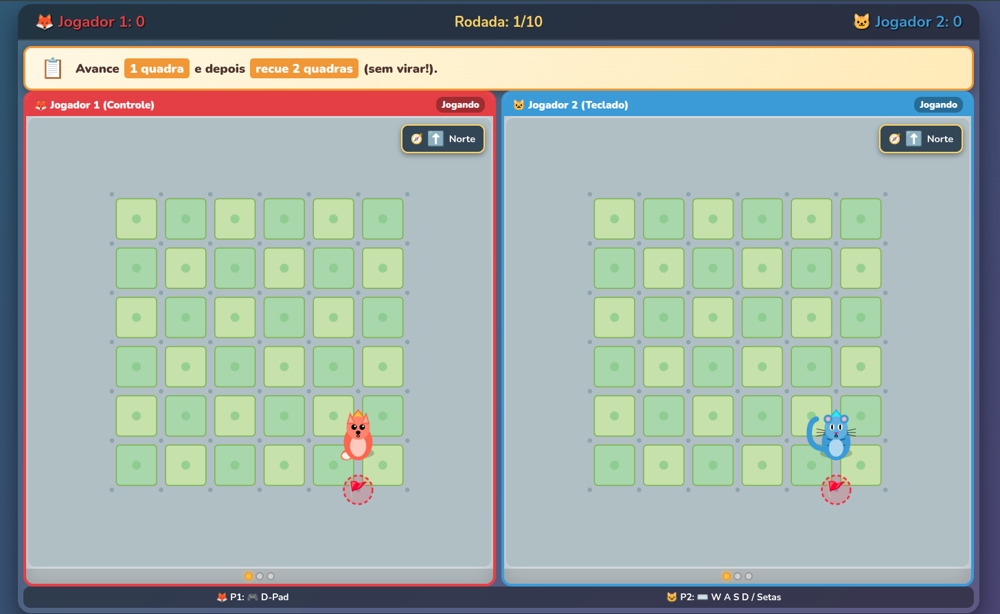
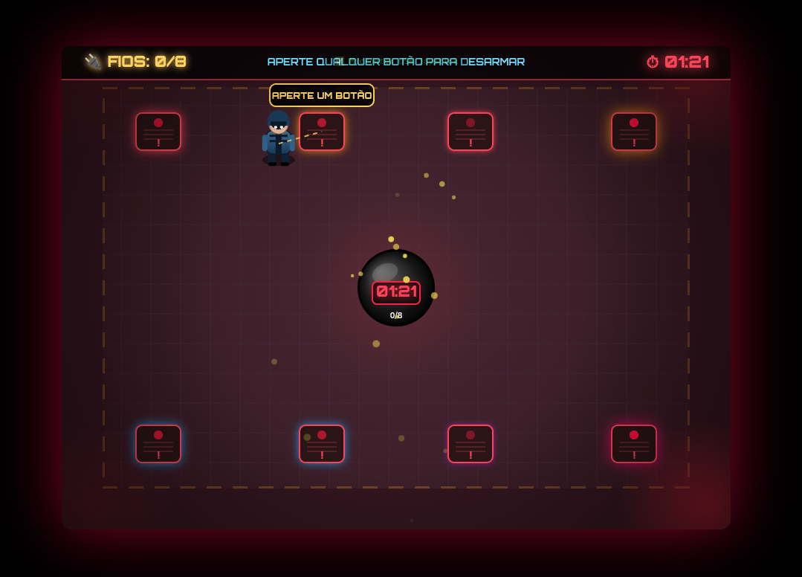
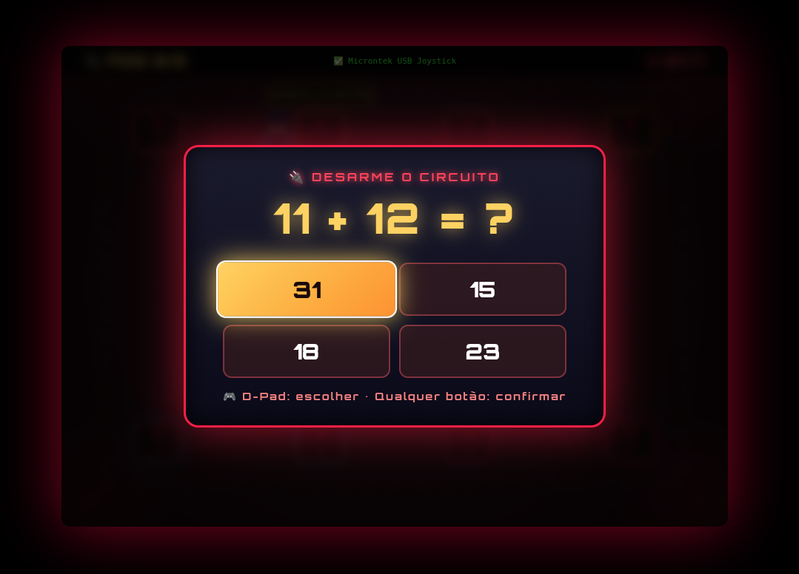
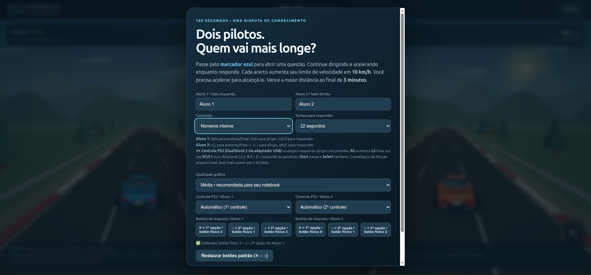
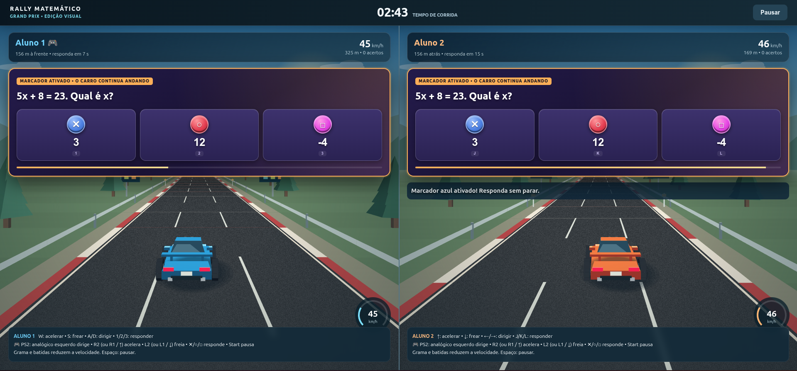

# Jogos de Matemática

**Jogos digitais para o ensino de Matemática, desenvolvidos com apoio do ChatGPT em HTML, CSS e JavaScript.**

Reúno neste repositório quatro jogos que desenvolvi para explorar possibilidades de ensino de habilidades matemáticas relacionadas aos descritores do Sistema de Avaliação da Educação Básica (SAEB). O material permite conhecer as propostas, acessar seus códigos e estudar possibilidades de adaptação às necessidades de outras turmas.

A proposta valoriza a **autoria docente**: o professor define os objetivos, as tarefas e as regras, utiliza a inteligência artificial como apoio à programação e revisa o recurso antes de utilizá-lo em aula. Os jogos trabalham recortes de habilidades matemáticas; sua relação com os descritores deve ser examinada conforme a matriz de referência e o planejamento adotados.

Repositório: [luangz19/Jogos_de_Matematica](https://github.com/luangz19/Jogos_de_Matematica).

## Jogos disponíveis

| Jogo | Conteúdos e habilidades | Participantes | Situação na experiência relatada |
| --- | --- | --- | --- |
| **Batalha Cartesiana** | Pares ordenados, eixos, quadrantes e localização no plano cartesiano. | 2 | Utilizado com estudantes do 8º ano. |
| **Orientação Espacial** | Leitura de percursos, direção, sentido e movimentos em relação à orientação do personagem. | 2 | Desenvolvido, ainda não aplicado à turma. |
| **Desarme a Bomba** | Adição, subtração, multiplicação, divisão exata e potenciação com números naturais. | 1 | Desenvolvido, ainda não aplicado à turma. |
| **Rally Matemático** | Adição de inteiros, porcentagem, equações do 1º grau, área e perímetro de retângulos, potenciação ao quadrado e raízes quadradas exatas. | 2 | Utilizado com estudantes do 8º ano. |

## Como utilizar

1. Baixe o arquivo `.html` do jogo desejado ou uma cópia do repositório. Se o download estiver compactado, extraia os arquivos.
2. Abra o arquivo do jogo em um navegador com JavaScript habilitado. Cada jogo reúne seu código em um único arquivo HTML.
3. Conecte o controle, quando necessário, e pressione um botão com a página aberta. Confira a indicação de reconhecimento na tela.
4. Leia os comandos específicos do jogo e faça uma partida de familiarização.
5. Para atividades coletivas, conecte o computador a uma televisão ou a um projetor e organize o revezamento dos participantes.

**Equipamentos:** computador ou notebook, teclado e, conforme o jogo, controle compatível com o navegador. Um controle PS2 precisa de adaptador USB para a conexão ao computador.

**Atenção à configuração:** nas versões aqui descritas, Batalha Cartesiana e Orientação Espacial utilizam um controle para o primeiro jogador e o teclado para o segundo. Desarme a Bomba permite jogar pelo teclado ou pelo controle. Rally Matemático permite dois jogadores no teclado ou a combinação com um ou dois controles.

<details>
<summary>Alternativa: abrir os jogos por um servidor local</summary>

Se a abertura direta do arquivo apresentar restrições no navegador, uma alternativa é utilizar Python 3. Abra o terminal na pasta que contém os jogos e execute:

```bash
python3 -m http.server 8000 --bind 127.0.0.1
```

Depois, acesse [http://127.0.0.1:8000](http://127.0.0.1:8000) e selecione o arquivo do jogo. Para encerrar o servidor, pressione `Ctrl + C` no terminal.

</details>

## Batalha Cartesiana

Dois jogadores disputam quem chega primeiro à coordenada indicada no plano cartesiano. A partida possui **dez rodadas**, com destinos sorteados entre coordenadas inteiras de −5 a 5. O primeiro a alcançar o destino recebe **dez pontos**.

| Tela inicial | Localização no plano cartesiano |
| :---: | :---: |
|  |  |

Arquivo: [1-Batalha-Cartesiana.html](1-Batalha-Cartesiana.html).

| Ação | Comando |
| --- | --- |
| Iniciar ou reiniciar | Botão na tela, `Enter` ou um botão frontal do controle. |
| Movimentar o jogador 1 | Direcional do controle; o código também lê os eixos do analógico. |
| Movimentar o jogador 2 | Setas do teclado. |

**Possibilidade de trabalho:** pedir que os estudantes identifiquem primeiro a coordenada horizontal e depois a vertical, expliquem o significado dos sinais e comparem a localização de pontos nos diferentes quadrantes.

## Orientação Espacial

Na interface, o jogo aparece como **Batalha de Orientação**. Os participantes conduzem uma raposa e um gato seguindo instruções como avançar, recuar e virar à direita ou à esquerda. São **dez percursos**, apresentados em ordem embaralhada a cada partida.

É necessário executar a sequência solicitada: uma ação diferente da esperada elimina o participante daquela rodada. Quem completa corretamente o percurso primeiro recebe dez pontos.

| Tela inicial | Execução de um percurso |
| :---: | :---: |
|  |  |

Arquivo: [2-orientacao-espacial.html](2-orientacao-espacial.html).

| Ação | Jogador 1 — controle | Jogador 2 — teclado |
| --- | --- | --- |
| Avançar | Direcional para cima | `W` ou seta para cima |
| Recuar sem virar | Direcional para baixo | `S` ou seta para baixo |
| Virar à esquerda | Direcional para a esquerda | `A` ou seta para a esquerda |
| Virar à direita | Direcional para a direita | `D` ou seta para a direita |

Para iniciar, utilize o botão da tela, `Enter` ou um botão frontal do controle.

**Possibilidade de trabalho:** discutir por que “avançar” depende da direção para a qual o personagem está voltado. Virar muda sua orientação; avançar ou recuar muda sua posição. O professor também pode pedir que os estudantes representem o percurso no papel antes de executá-lo.

## Desarme a Bomba

O participante percorre o cenário, aproxima-se de **oito painéis** e resolve operações matemáticas para desarmá-los. O contador começa em **90 segundos** e fica suspenso enquanto uma questão está aberta. Uma resposta incorreta ou o esgotamento do contador encerra a partida.

| Exploração do cenário | Questão matemática |
| :---: | :---: |
|  |  |

Arquivo: [3-desarme-a-bomba-v2.html](3-desarme-a-bomba-v2.html).

| Ação | Teclado | Controle |
| --- | --- | --- |
| Iniciar ou reiniciar | `Enter` ou barra de espaço | Um botão frontal |
| Movimentar o personagem | Setas ou `W`, `A`, `S`, `D` | Analógico |
| Interagir com um painel próximo | `Enter` ou barra de espaço | Um botão frontal |
| Selecionar uma resposta | Setas | Direcional ou analógico |
| Confirmar a resposta | `Enter` ou barra de espaço | Um botão frontal |

Também é possível responder clicando na alternativa com o mouse. Para movimentar o personagem com o controle, utilize o analógico: nesta versão, o direcional é lido para a escolha das alternativas, mas não movimenta diretamente o personagem.

**Possibilidade de trabalho:** discutir os procedimentos de cálculo antes da confirmação da resposta e retomar os erros em uma atividade coletiva. Os painéis trabalham operações com números naturais, incluindo potências de expoentes 2 e 3.

## Rally Matemático

Dois participantes disputam uma corrida de **três minutos**. Ao passar por um marcador azul, o jogador recebe uma questão e continua dirigindo enquanto responde. Cada acerto aumenta o limite de velocidade em **10 km/h**, até o máximo de **160 km/h**; o jogador precisa acelerar para atingir esse limite.

Vence quem percorre a maior distância. Sair da pista e colidir com o outro veículo reduzem a velocidade.

| Configuração da partida | Corrida com questões |
| :---: | :---: |
|  |  |

Arquivo: [4-rally_matematico.html](4-rally_matematico.html).

### Configuração inicial

- Informe os nomes ou identificadores dos participantes.
- Escolha o conteúdo: números inteiros, porcentagem, equações do 1º grau, área e perímetro, potências e raízes ou circuito misto.
- Defina o tempo para responder: **10, 15 ou 22 segundos**.
- Escolha a qualidade gráfica conforme o computador utilizado.
- Selecione os controles de cada participante ou a opção **Somente teclado**.

### Comandos no teclado

| Ação | Jogador 1 | Jogador 2 |
| --- | --- | --- |
| Acelerar | `W` | Seta para cima |
| Frear | `S` | Seta para baixo |
| Dirigir | `A` e `D` | Setas para a esquerda e para a direita |
| Responder à 1ª, 2ª ou 3ª alternativa | `1`, `2`, `3` | `J`, `K`, `L` |
| Pausar ou continuar | Barra de espaço, `P` ou `Esc` | Barra de espaço, `P` ou `Esc` |

### Controle PS2 e calibração

O mapeamento previsto utiliza o analógico esquerdo para dirigir, `R2` para acelerar e `L2` para frear. Há alternativas por `R1`/`L1` e pelo direcional para cima/baixo. O reconhecimento físico desses comandos depende do adaptador utilizado.

Antes de começar, calibre as respostas:

1. Conecte o controle e pressione um botão para ativar sua leitura.
2. Atribua o controle ao participante correspondente no menu.
3. Na área **Botões de resposta**, clique no campo de `✕`, solte os botões e pressione uma vez o botão físico correspondente.
4. Repita o procedimento para `○` e `□`.
5. Confira a indicação do mapeamento e inicie a disputa.

Com apenas um controle, atribua-o a um participante e selecione **Somente teclado** para o outro. Ao final, a tela de resultados permite revisar as questões e baixar um arquivo `.txt` com informações da partida.

**Possibilidade de trabalho:** selecionar um conteúdo por aula e usar a revisão das questões para discutir os cálculos. O resultado da corrida combina respostas matemáticas e condução do veículo.

## Utilização pedagógica e contexto

Os jogos foram elaborados em setembro de 2026 no contexto do meu trabalho na **Escola Municipal Professora Ivanilde Braga Brandão**, escola de tempo integral situada em área rural e ribeirinha de Rio Preto da Eva, Amazonas.

**Batalha Cartesiana e Rally Matemático** foram utilizados com estudantes do 8º ano no final de setembro e em 1º de outubro de 2026, com apoio de notebook, televisão de 62 polegadas e controle. **Orientação Espacial e Desarme a Bomba** foram desenvolvidos, mas ainda não haviam sido aplicados à turma no período relatado.

A experiência indicou receptividade dos estudantes, com destaque para o Rally Matemático. Essas observações descrevem o interesse pela atividade e não constituem uma medida de ganho de aprendizagem.

Para organizar a aula:

1. Selecione a habilidade e revise as tarefas antes da aplicação.
2. Reserve um momento para os estudantes conhecerem os comandos.
3. Organize duplas, revezamento e oportunidades de participação.
4. Peça justificativas e registros das respostas, além da pontuação.
5. Retome as dificuldades em atividades no quadro ou no caderno.

## Tecnologias e funcionamento

- **HTML:** estrutura das telas.
- **CSS:** apresentação visual e organização da interface.
- **JavaScript:** regras, cálculos, entradas e atualização dos jogos.
- **SVG e Canvas 2D:** construção dos cenários e elementos gráficos.
- **Gamepad API:** leitura dos controles pelo navegador.

Os jogos executam sua lógica no navegador, sem instalação de pacotes ou etapa de compilação. Batalha Cartesiana, Orientação Espacial e Desarme a Bomba consultam o Google Fonts para carregar fontes; o código também prevê fontes alternativas do sistema. O reconhecimento dos controles deve ser conferido no conjunto de navegador, sistema operacional e adaptador que será usado na aula.

## Possibilidades de adaptação

O código pode ser estudado para alterar tarefas, percursos, regras e formas de apresentação. Alguns pontos de partida são:

| Jogo | Trecho do código | Possibilidade |
| --- | --- | --- |
| Batalha Cartesiana | `gerarCoordenadasAleatorias` | Ajustar os destinos sorteados; mudanças nos limites devem acompanhar a grade e o desenho dos eixos. |
| Orientação Espacial | `BANCO_RODADAS` | Criar percursos, mantendo instrução, posição inicial, destino e sequência de comandos coerentes. |
| Desarme a Bomba | `generateProblem` e `panels` | Alterar operações, valores e distribuição das tarefas entre os painéis. |
| Rally Matemático | `question(type)` | Revisar ou ampliar questões, alternativas e explicações. |

Depois de uma alteração, confira as respostas e teste o funcionamento. Registre a versão utilizada e preserve a distinção entre desenvolvimento do jogo, teste técnico e aplicação com estudantes.

## Autoria

**Professor Luan Gonzaga Pires Costa** — professor de Matemática e autor das propostas, desenvolvidas com apoio do ChatGPT na programação.

[Perfil no GitHub](https://github.com/luangz19) · [Repositório dos jogos](https://github.com/luangz19/Jogos_de_Matematica)

As imagens deste README são capturas de tela dos jogos. Os arquivos da pasta `imagens/` devem permanecer junto ao README para que sejam exibidos no GitHub.
